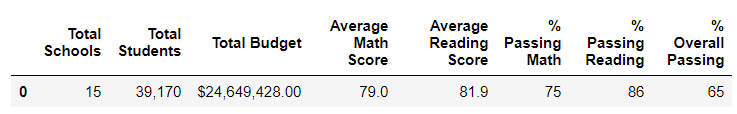
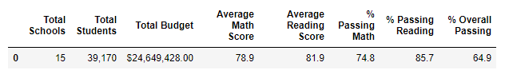
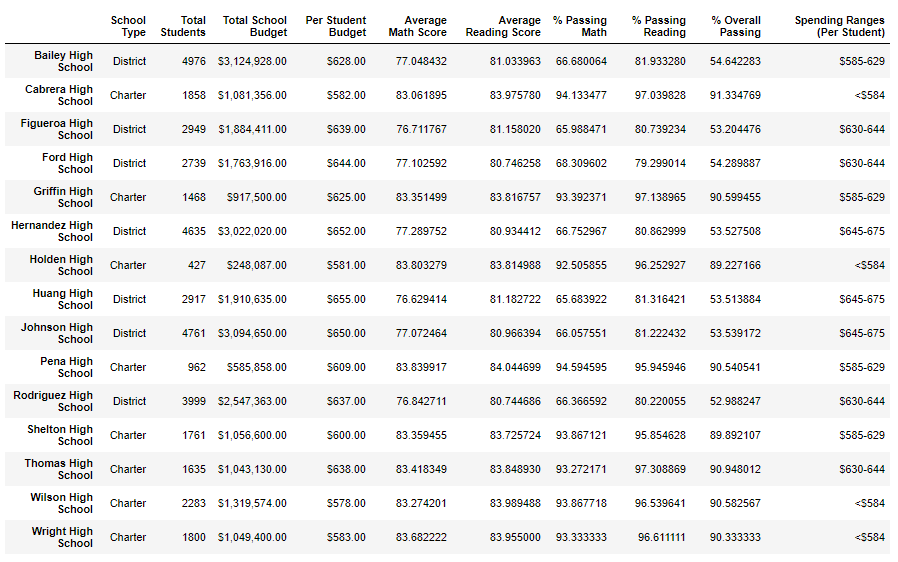
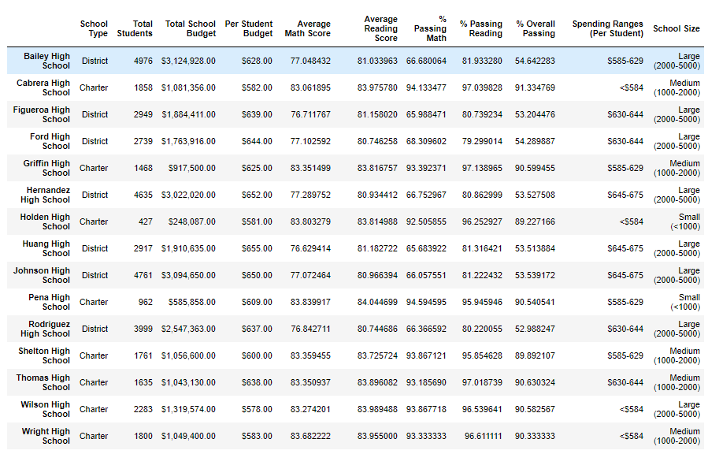
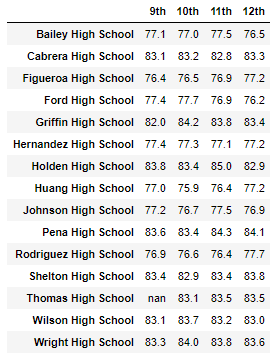
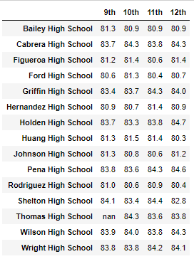
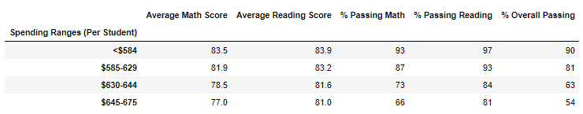
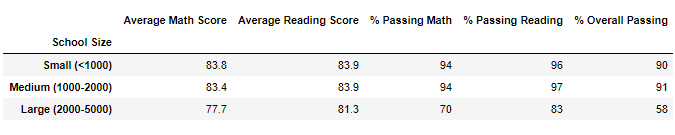
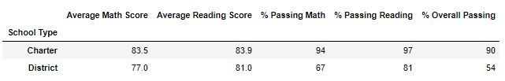

# School_District_Analysis

## Overview of the school district analysis

## Overview of the school district analysis:
* In this project we analyzed school funding and standerdized test scores for different high school districts and prepared a data set to show performance trends and patterns to assist the School Board in decision making regarding budget allotments. 

* During this project, the Family Educational Rights and Privacy Act was taken into account in order to treat the data with the utmost confidentiality.

* This script we wrote on Jupyter Notebook helped us exhibit in tables and calculate the following values: Distric summary, high school summaries and scores based on sepending, type and size. 

* Data Sets used on this script:
    * students_complete.csv
    * schools_complete.csv

* Programs used:
    * Conda version 4.9.2
    * Anaconda version 1.7.2
    * Python version 3.8.5
    * Jupyter Notebook version 6.1.4
    * Pandas version 1.2
    * Numpy version 1.19.5

# Results

## District summary results: 
In this section of the analysis we can see major education indicators of the district we are studying. As you can see there are 15 highschools in this district, each with its own characteristics.

### District Summary 01:

   * The following table contains information regarding the school district we are studying containing information of 39,170 students ranging from 9th - 12th grade. As we can see, the Total Budget of this district is $24,649,428.00 and the Overall Percentage of Students who pass the math and reading section of standerdized tests is 65%.  
 
 ### District Summary 02:
 
 
   * In the second table we had to update the data set because there were flawed items that had to be dropped from the aggregate information. The reduction had an impact on the Math, Reading and Overall Passing Percentage, all of this values dropped by around 0.1. 

## School summary results:
In this section we have two tables, one containing the aggregate information regarding the 15 schools of the district and the second table will show the information with the subtraction of the flawed items. Likewise, we have laied out the performance of each high school across different variables school so that they can be compared.  

### School summary 01

### School summary 02

## Thomas High School's performance relative to other schools after removing faulty grades: 

As we've seen in the last tables Thomas High School has an average score for math of 83.89 and reading of 83.89, and its passing percentages for math and reading are 93.18% and 97.98% respectively, giving an overall passing percentage of 90%. This information compares failry well to the results of schools with similar characteristics. For example, medium sized schools (1000 - 2000 students) have an average math score of 83.4 and reading of 83.9. The passing percentage for math is 94 and for reading is 97. In similar fashion, Charter type schools performed similar to Thomas High school with average math and reading scores of 83.5 and 83.9 respectively. Comparing spending per student we can see that it out performed the schools in the same braket of around $650. The average math and reading scores for this schools was 78.5 and 81.6. We can conclude that Thomas High School si having a return of investment on it's current budget. When we analyse the top five schools we can see that Thomas High School is placede in 2nd, based in Overall Passing%. 

## Thomas High School's performance after removing ninth grade metrics:

Removing certain item from the data set may have a little impact on the overall metrics because it only dropped 0.1% of the overall percentage of students who passed both reading and math.

   ## Math and reading scores by grade:
   
   ### High School Math Scores
   
   
   
   ### High School Reading Scores
   
   
   
   ## Scores by school spending:
   
   
   
   ## Scores by school size:
   
   
   
   ## Scores by school type: 
   
   
   
 # Summary: Four major changes in the updated school district analysis after reading and math scores for the ninth grade at Thomas High School have been replaced with NaNs
    1. The total amount of students dropped from 39,170 to 37,809.
    2. 1,361 students had to be removed from the series, pushing Thomas High School into the medium sized bin. 
    3. Removing this students pushed Thomas High School into the $650 budget per student range. 
    4. It had no effect on the type of school.

